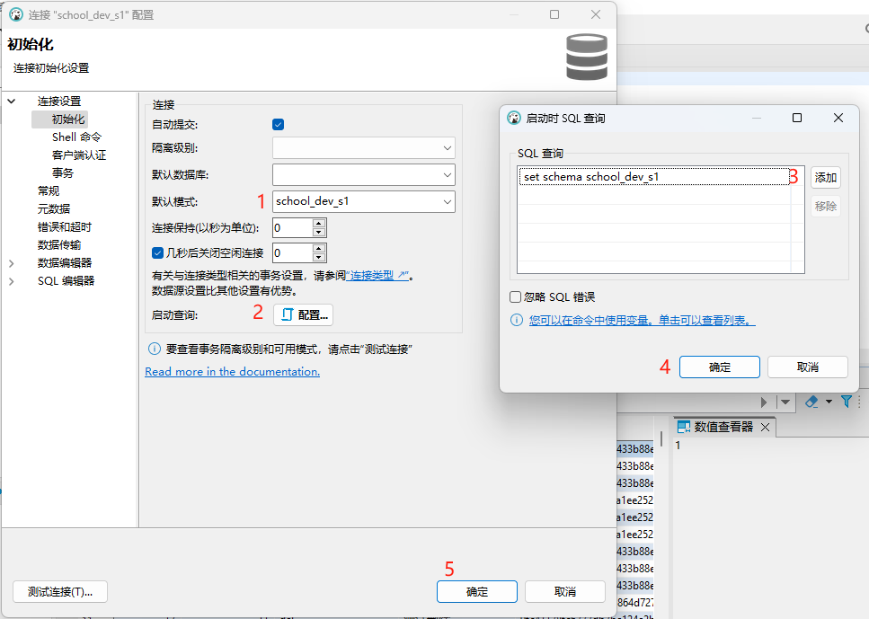

## 支持达梦数据库
> 官网: https://www.dameng.com/DM8.html  
> 工具下载连接: https://www.dameng.com/list_103.html

## 安装数据库服务

- 镜像下载

- 配置信息:
  - 端口: 5236
  - 默认账号密码：SYSDBA/SYSDBA001
  - 数据挂载目录: /opt/dmdbms/data
  - 环境变量: **(只有第一次初始化实例时会生效，一旦错过只能删除重来)**
    - CASE_SENSITIVE=0  **忽略大小写, 一定要加**
    - UNICODE_FLAG=1 **设置字符集为utf8**
    - LENGTH_IN_CHAR=1 **设置varchar长度为字符长度**
> 其余参数配置详见: [DMInit使用手册](https://eco.dameng.com/document/dm/zh-cn/pm/view-dminit-parameters.html)

## 安装客户端工具
> 官方提供工具仅支持国产操作系统/x86架构的windows/linux
>> 参考文档: [达梦数据库安装指南](https://eco.dameng.com/document/dm/zh-cn/start/dm-install-docker.html)
- 下载第一个工具: 数据库管理系统DM8开发版, 里面包含了所有的工具  
  
- 安装时只选择客户端工具和驱动，无需选择服务  
  


# 连接工具
- **使用官方提供的 “DM管理工具”**
  > 配置默认库名, 如不设置默认库名, 每次sql语句都需要指定库名
  > 

- **使用DBeaver工具连接**
  > 参考：  https://juejin.cn/post/7274895896286707746  
  > 配置默认库名
  > 

# 数据迁移

1. 创建工程-右键迁移文件夹-新建迁移，名称随意  
   
2. 选择迁移方式，推荐库->库，如果执行sql可能存在兼容问题  
   
3. 填写迁移和被迁移库连接信息  
   
4. 迁移选项，建议勾上保持大小写，不勾可能存在大小写兼容问题  
   
5. 选择库和表  
   
6. 查看失败数据  
   
> 这几个失败的主要原因: 
> 1. 存在重复索引, 虽然索引名称不同, 但对应的列相同
> 2. 迁移时没有设置字符串长度以字符为单位, 插入数据时字段超长
> 3. 添加唯一索引时数据不唯一，详细原因见:  **常见语法差异** - 添加联合索引时，null也被认为是重复的

# sql差异
> 参考文档:   
> [mysql迁移到DM](https://download.dameng.com/eco/docs/DM_DBA%E6%89%8B%E8%AE%B0%E4%B9%8BMySQL%E7%A7%BB%E6%A4%8D%E5%88%B0DM.pdf)  
> [mysql,Dm差异](https://cloud.tencent.com/developer/article/1632394)

## 常见sql操作
### 创建表
```sql
CREATE TABLE test_table4 (
id bigint NOT NULL AUTO_INCREMENT,
test_name varchar(50) NOT NULL,
test_value1 varchar(20) NOT NULL,
test_value2 varchar(20) NOT NULL,
PRIMARY KEY ("id"), -- 设置主键
CLUSTER KEY ("test_name"), -- 创建普通索引
CLUSTER UNIQUE KEY ("test_value2","test_value1") -- 创建唯一索引
);
```
### 修改表
```sql
ALTER TABLE "test_table3" ADD COLUMN values1 varchar(20);
```

### 添加注释
```sql
comment ON TABLE test_table10 IS '测试10';
comment ON column test_table3.values2 IS '测试123';
```

### 索引操作
1. 创建索引
```sql
CREATE CLUSTER INDEX idx ON test_table3(test_name)
```
> 需要注意的是在同一个库中索引名称不能重复

2. 删除索引
```sql
-- 如果不存在则会报错
DROP INDEX emp_ename;
-- 如果不存在不会报错
DROP INDEX IF EXISTS emp_ename;
```

## 常见语法差异
- **语法分析错误: 无法识别[\`]符号**  
  mysql中 \` 用于声明数据库保留字段为普通字段，达梦中不支持，保留字段需要使用双引号括起来，如：
    ```sql
    SELECT "user"."name" from "user"
    ```
  
- **达梦数据库的 int 类型，不需要、也不能设置精度。** 如:
  `create table test1(v1 int(10),v2 varchar(20));`  需要更改成 `create table test1(v1 int,v2 varchar(20);`
- **创建表的时候，不支持在列的后面直接加 comment 注释**，使用 COMMENT ON  IS 代替，如：
   ``` sql
   COMMENT ON TABLE xxx IS xxx  ;
   COMMENT ON COLUMN xxx IS xxx
   ```
- **同一个库中索引名称不能重复**
- **无法添加重复索引**, 例如对表A字段a1添加两个索引，会报错

- **添加联合索引时，null也被认为是重复的**，如下表， 对字段TEST_VALUE1和TEST_VALUE2添加唯一联合索引时，mysql可以成功，但达梦数据库会报错：SQL 错误 [23000]: 违反唯一性约束  
  
  |ID|TEST_NAME|TEST_VALUE1| TEST_VALUE2 |
  |--|---------|-----------|-------------|
  |1|3432344342443|1| null        |
  |2|3432344342443|1| null        |


- 在 MySQL 中时间类型 TIMESTAMP 默认 default 设置为`0000-00-00 00:00:00`，而在 DM 中 TIMESTAMP 类型数据不能为`0000-00-0000:00:00`，**在DM中是不合法的**，必须在`0001-01-01 00:00:00.000000` 到 `9999-12-31 23:59:59.999999`之间。
- **对于字段的 default 设置，默认的字符或字符串默认值，需要添加单引号' '**，如
  `a char(10) default ‘abc’`

- **不支持 date_sub 函数，使用 dateadd(datepart,n,date) 代替**, 其中，`datepart`可以为：`year(yy,yyyy)`，`quarter(qq,q)`，`month(mm,m)`，`dayofyear(dy,y)`，`day(dd,d)`，`week(wk,ww)`，`weekday(dw)`，`hour(hh)`，`minute(mi,n)`，`second(ss,s)`， `millisecond(ms)`
    ``` sql
    select dateadd(month, -6, now());
    select dateadd(month, 2, now());
    ```
- **不支持 date_format 函数**，它有三种代替方法：
  1. **使用 datepart 代替**：
     语法：`datepart(datepart, date)`，返回代表日期的指定部分的整数，
     `datepart`可以为：`year(yy,yyyy)`，`quarter(qq,q)`，`month(mm,m)`，`dayofyear(dy,y)`，`day(dd,d)`，`week(wk,ww)`，`weekday(dw)`，`hour(hh)`，`minute(mi,n)`，`second(ss,s)`， `millisecond(ms)`  
     例子:
        ```sql
        select datepart(year, '2018-12-13 08:45:00'); --2018
        select datepart(month, '2018-12-13 08:45:00'); --12
        ```
  2. **使用 date_part 代替**。 功能和 datepart 一样，写法不同，参数顺序颠倒，且都要加引号
       ```sql
       select date_part('2018-12-13 08:45:00', 'year');--2018
       select date_part('2018-12-13 08:45:00', 'mm'); -- 12
       ```
  3. **使用 extract 代替**，
     语法：`extract(dtfield from date)`，从日期类型`date`中抽取`dtfield`对应的值`dtfield` 可以是`year`，`month`，`day`，`hour`，`minute`，`second`

- **不支持 substring_index 函数， 使用 substr / substring 代替**
    ```sql
    substr(char[,m[,n]]);
    substring(char[from m[ for n]]);
    ```
- **不支持 group_concat 函数，使用 wm_concat 代替**
    ```sql
    select wm_concat(id) as idstr from persion ORDER BY id ;
    ```
- **不支持 from_unixtime 函数，使用 round 代替**
    ```sql
    round(date[,format])
    ```
- **不支持 case-when-then-else**
    ```sql
    select case  when id = 2 then "aaa" when id = 3 then "bbb" else "ccc" end as test from (select id from person) tt;
   ```
- **current_timestamp 的返回值带有时区**
    ```sql
    select current_timestamp(); --2018-12-17 14:34:18.433839 +08:00
    ```
- **convert(type, value) 函数**  
  与 mysql 的 convert 一样，但是参数是反过来的，mysql 是 convert(value, type)
- **不支持 on duplicate key update**  
  使用 merge into 代替
- **不支持 ignore**, 即 `insert ignore into`
- **不支持 replace into**  
  使用 merge into 代替
- **不支持 if。**
- **不支持 ""，只支持 ''**, 这里指的是值只能使用单引号, 表名还是使用双引号, 如: `select * from "test_table" where test_name = 'test'`
- ~~**不支持 auto_increment**，使用 identity 代替, 如： `identity(1, 1)`，从 1 开始，每次增 1~~   **实际使用下来是可以支持auto_increment的**
- **不支持 longtext 类型**  
  可用 CLOB 代替。

# gorm 连接dm指南
> 参考:  
> https://eco.dameng.com/document/dm/zh-cn/pm/go-rogramming-guide.html#11.8%20ORM%20%E6%96%B9%E8%A8%80%E5%8C%85

## 开启连接
```go
package config
  import (
      "config"
      "fmt"
      gormLog "ginmw/adapterLog"
      "ginmw/definition"
      "strconv"
      "time"

      dameng "github.com/godoes/gorm-dameng"
      "gorm.io/gorm"
      "gorm.io/gorm/logger"
  )

  func Init() {
      dbLogger := gormLog.Default.LogMode(logger.Info)

      // 指定数据库名称
      options := map[string]string{
          "schema": config.Config.DmConfig.Db,
      }
      // dm://user:password@host:port?schema=SYSDBA[&...]
      port, _ := strconv.Atoi(config.Config.DmConfig.Port)
      // 指定连接信息
      dsn := dameng.BuildUrl(
          config.Config.DmConfig.User,
          config.Config.DmConfig.Password,
          config.Config.DmConfig.Host,
          port,
          options,
      )
      wdb, err = gorm.Open(dameng.Open(dsn), &gorm.Config{
          Logger: dbLogger,
      })
      if err != nil {
          fmt.Println(err)
          panic(fmt.Sprintf("mysql connect error: %s", err))
      }
      //设置连接池，暂未验证连接池是否正常
      setPool(wdb)
  }
```
## 测试常用dao方法, 已验证功能正常
  ```go
  package main
  
  import (
    "config"
    "config/db"
    "strconv"
    "support/logger"
    "tableModel"
    "testing"
  
    "gorm.io/gorm/clause"
  
    "gorm.io/gorm"
  )
  
  func Init() {
    config.Init(false, "./config/manage_service.conf")
  
    logger.SetLogFile(config.Config.LogDir, config.Config.LogFile, config.Config.LogBufSize<<10)
    logger.Info("manager_service for school config: %s", config.Config)
  
    /*初始化mysql连接*/
    db.Init()
  }
  
  func TestSql(t *testing.T) {
    Init()
    db := db.GetConnection()
    // 单个和批量创建
    Create(db)
    // 单个和批量更新
    Update(db)
    // 存在则更新，不存在则插入
    Upsert(db)
    // 删除
    Delete(db)
    // 查询
    Select(db)
    // 忽略deleted_at查询
    SelectUnscoped(db)
    // 分组查询
    SelectByGroup(db)
    // join查询
    SelectByJoin(db)
    //InsertIgnore
    InsertIgnore(db)
    // SelectJson
    SelectJson(db)
  }
  
  func Create(db *gorm.DB) {
  
    // 单个创建
    phone := "18888888888"
    user := tableModel.User{
      OrgID:     2,
      LoginName: "t2damengtest2",
      UserName:  "t2damengtest2",
      Password:  "14e1b600b1fd579f47433b88e8d85291",
      UserType:  4,
      Phone:     &phone,
      Active:    1,
    }
    err := db.Create(&user).Error
    if err != nil {
      logger.Error("create user error: %s", err)
    }
    logger.Info("create user id: %d", user.ID)
  
    // 批量创建
    userList := make([]*tableModel.User, 0)
    for i := 0; i < 10; i++ {
      userList = append(userList, &tableModel.User{
        OrgID:     2,
        LoginName: "t2damengtest2" + strconv.Itoa(i),
        UserName:  "t2damengtest2" + strconv.Itoa(i),
        Password:  "14e1b600b1fd579f47433b88e8d85291",
        UserType:  4,
        Phone:     &phone,
        Active:    1,
      })
    }
    err = db.Create(&userList).Error
    if err != nil {
      logger.Error("batch create user error: %s", err)
    }
    for i := range userList {
      logger.Info("create user id: %d", userList[i].ID)
    }
  
  }
  
  func Update(db *gorm.DB) {
    // 使用Update单个更新
    err := db.Model(&tableModel.User{}).
      Where("id = ?", 30294).
      Update("user_name", "t2damengtest").
      Error
    if err != nil {
      logger.Error("update user error: %s", err)
    }
    // 使用Updates更新
    err = db.Model(&tableModel.User{}).
      Where("id = ?", 30293).
      Updates(map[string]interface{}{"user_name": "t2damengtest", "phone": "11111111111"}).
      Error
    if err != nil {
      logger.Error("update user by condition error: %s", err)
    }
    // 批量更新
    err = db.Model(&tableModel.User{}).
      Where("id in ?", []int64{30292, 30291}).
      Update("user_name", "t2damengTestBatch").Error
    if err != nil {
      logger.Error("batch update user error: %s", err)
    }
  }
  
  func Delete(db *gorm.DB) {
    // 单个删除
    db.Where("id = ?", 407).Delete(&tableModel.User{})
    // 批量删除
    db.Where("id in ?", []int64{406, 405}).Delete(&tableModel.User{})
  }
  
  func Select(db *gorm.DB) {
    // 单个查询
    var user tableModel.User
    err := db.Where("id = ?", 2).First(&user).Error
    if err != nil {
      logger.Error("select user by id error: %s", err)
    }
    logger.Info("user: %+v", user)
  
    // 批量查询
    var userList []tableModel.User
    err = db.Where("id in ?", []int64{2, 4, 3}).Find(&userList).Error
    if err != nil {
      logger.Error("batch select user error: %s", err)
    }
    logger.Info("user: %+v", userList)
  
  }
  
  // 验证软删查询
  func SelectUnscoped(db *gorm.DB) {
    // 查询已被删除的, 没有Unscoped(),期望获取不到
    var user1 tableModel.User
    err := db.Where("id = ?", 407).First(&user1).Error
    if err != nil {
      logger.Error("select user by id error: %s", err)
    }
    logger.Info("user1: %+v", user1)
  
    // 查询被删除的, 有Unscoped(),获取到
    var user2 tableModel.User
    err = db.Unscoped().Where("id = ?", 407).First(&user2).Error
    if err != nil {
      logger.Error("select user by id error: %s", err)
    }
    logger.Info("user2: %+v", user2)
  }
  
  func SelectByGroup(db *gorm.DB) {
    // 聚合查询
    type userVo struct {
      OrgId int64 `gorm:"column:org_id"`
      Count int64 `gorm:"column:count"`
    }
    var userVoList []userVo
    err := db.Model(&tableModel.User{}).
      // 注意count是关键字，所以要加引号，不然虽然不报错但是查不出count值
      Select("org_id, count(*) as \"count\"").
      Group("org_id").
      Find(&userVoList).
      Error
    if err != nil {
      logger.Error("select user by group error: %s", err)
    }
    logger.Info("user: %+v", userVoList)
  }
  func SelectByJoin(db *gorm.DB) {
    type userVo struct {
      tableModel.User
      tableModel.Org
    }
    var userVoList []userVo
    err := db.Model(&tableModel.User{}).
      // 实践下来，除了表名是关键字外，其他表名可以不加引号
      Select("\"user\".*, org.*").
      Joins("left join org on \"user\".org_id = org.id").
      Find(&userVoList).Error
    if err != nil {
      logger.Error("select user by join error: %s", err)
    }
    logger.Info("user: %+v", userVoList)
  }
  
  func Upsert(db *gorm.DB) {
    var userList []*tableModel.User
    // 期望更新
    userList = append(userList, &tableModel.User{
      ID:        30294,
      OrgID:     2,
      LoginName: "t2damengUpsert",
      UserName:  "t2damengUpsert",
      Password:  "14e1b600b1fd579f47433b88e8d85291",
      UserType:  0,
      Active:    0,
    })
    // 期望插入
    userList = append(userList, &tableModel.User{
      OrgID:     2,
      LoginName: "t2damengUpsert",
      UserName:  "t2damengUpsert",
      Password:  "14e1b600b1fd579f47433b88e8d85291",
      UserType:  0,
      Active:    0,
    })
    err := db.Model(tableModel.User{}).
      Clauses(clause.OnConflict{
        Columns: []clause.Column{{Name: "id"}},
        DoUpdates: clause.AssignmentColumns(
          []string{
            "user_name",
          },
        ),
      }).CreateInBatches(userList, 200).Error
    if err != nil {
      logger.Error("upsert user error: %s", err)
    }
    logger.Info("upsert user success")
  }

  func InsertIgnore(db *gorm.DB) {
    var userList []*tableModel.User
    // 期望忽略插入
    userList = append(userList, &tableModel.User{
      ID:        30294,
      OrgID:     2,
      LoginName: "InsertIgnore",
      UserName:  "InsertIgnore",
      Password:  "14e1b600b1fd579f47433b88e8d85291",
      UserType:  0,
      Active:    0,
    })
    // 期望插入
    userList = append(userList, &tableModel.User{
      OrgID:     2,
      LoginName: "InsertIgnore",
      UserName:  "InsertIgnore",
      Password:  "14e1b600b1fd579f47433b88e8d85291",
      UserType:  0,
      Active:    0,
    })
    err := db.Model(tableModel.User{}).
      Clauses(clause.OnConflict{
        Columns:   []clause.Column{{Name: "id"}},
        DoNothing: true,
      }).CreateInBatches(userList, 200).Error
    if err != nil {
      logger.Error("upsert user error: %s", err)
    }
    logger.Info("upsert user success")
  }
  // mysql中字段类型为json，迁移后被转成varchar
  func SelectJson(db *gorm.DB) {
    var res *tableModel.InfiBoardMeeting
    err := db.Model(&tableModel.InfiBoardMeeting{}).
      Where("id = ?", 2).
      First(&res).Error
    if err != nil {
      logger.Error("select user by id error: %s", err)
    }
    logger.Info("res: %+v", res)
  }
  ```
