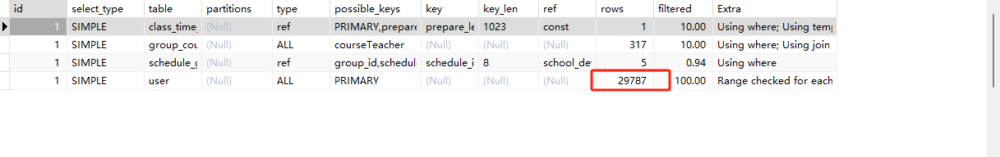
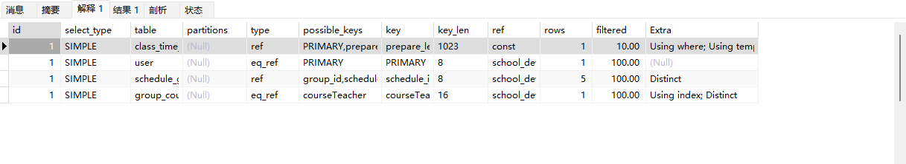

```sql
SELECT DISTINCT  `user`.id, `user`.login_name, `user`.user_name, `user`.avatar 
FROM `class_time_schedule`
	LEFT JOIN schedule_group ON schedule_group.schedule_id = class_time_schedule.id
	LEFT JOIN group_course_teacher ON group_course_teacher.group_id = schedule_group.group_id
	LEFT JOIN `user`
	ON class_time_schedule.primary_id = `user`.id 
		OR  group_course_teacher.user_id = `user`.id 
WHERE class_time_schedule.prepare_lesson_id = 'xxx'
	AND group_course_teacher.course_id = 2
	AND `class_time_schedule`.`deleted_at` IS NULL
```



不能使用or条件连接，会导致索引失效，初步判断是mysql执行无法判断有多少数据，所以选择执行全表查询。  

修改，可以走索引：

```sql
SELECT DISTINCT  `user`.id, `user`.login_name, `user`.user_name, `user`.avatar 
FROM `class_time_schedule`
	LEFT JOIN schedule_group ON schedule_group.schedule_id = class_time_schedule.id
	LEFT JOIN group_course_teacher ON group_course_teacher.group_id = schedule_group.group_id
	LEFT JOIN `user`
	ON class_time_schedule.primary_id = `user`.id 
-- 		OR  group_course_teacher.user_id = `user`.id 
WHERE class_time_schedule.prepare_lesson_id = 'xxx'
	AND group_course_teacher.course_id = 2
	AND `class_time_schedule`.`deleted_at` IS NULL
```



最终方案：使用子查询，先查出来userId， 再根据userId查出user信息。